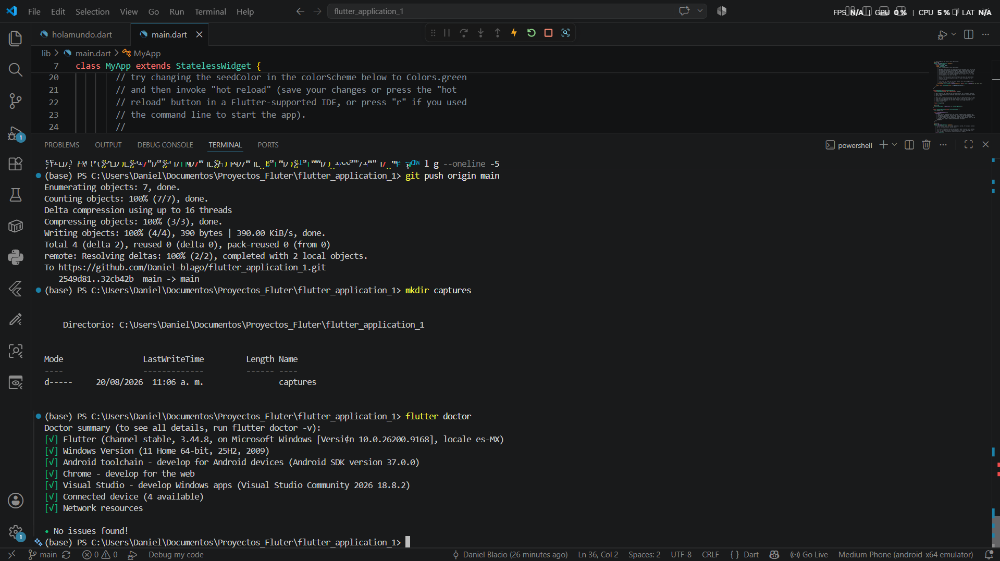
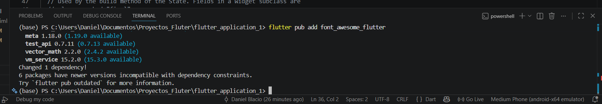
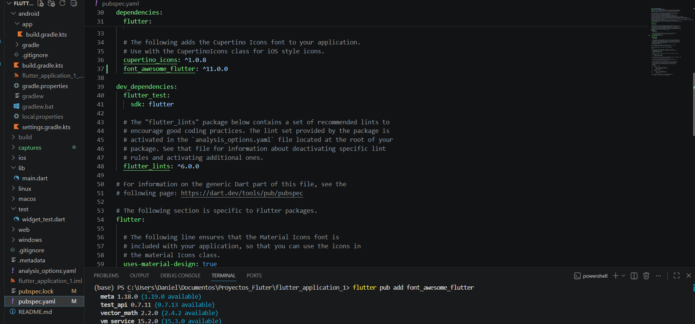
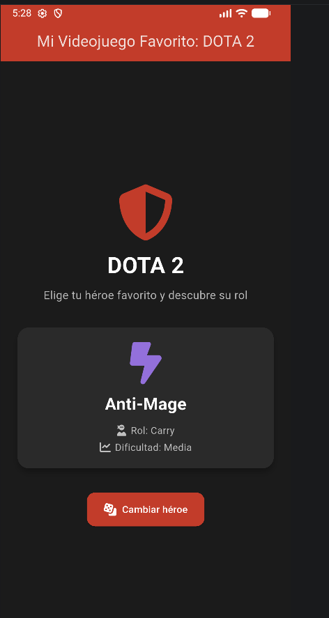
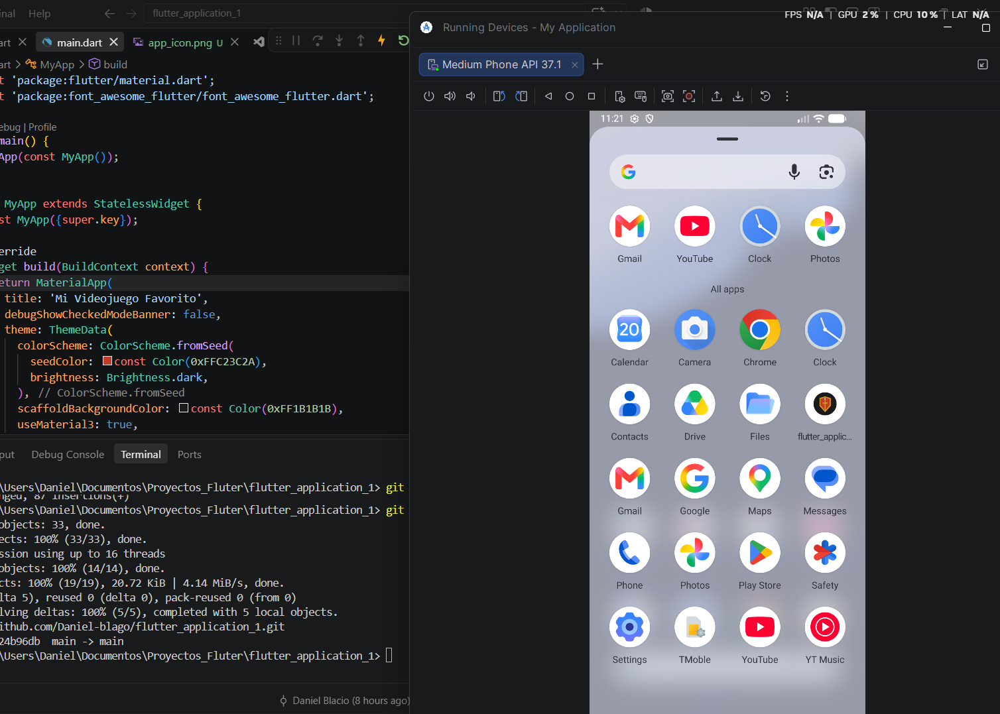

# Mi Videojuego Favorito: DOTA 2 🎮

Aplicación desarrollada en Flutter como proyecto integrador de la asignatura.
Presenta información sobre héroes favoritos del videojuego DOTA 2 mediante una interfaz interactiva.

## Autor
Daniel Blacio

## Objetivo
Desarrollar una aplicación básica en Flutter que demuestre la creación de un proyecto,
el uso de widgets iniciales, la ejecución en un emulador, la instalación de un paquete
externo y la publicación del proyecto en GitHub.

## Descripción de la aplicación
La app presenta una pantalla principal con el tema "Mi videojuego favorito: DOTA 2".
Muestra información de un héroe (nombre, rol y dificultad) dentro de una tarjeta (Card),
y cuenta con un botón que permite alternar entre distintos héroes favoritos, actualizando
dinámicamente el ícono, el nombre y los datos mostrados.

## Tecnologías y widgets utilizados
- `MaterialApp`, `Scaffold`, `AppBar`
- `Column`, `Row`, `Card`
- `ElevatedButton` con interacción (`setState`)
- Colores personalizados con `ColorScheme` y `Color`
- Paquete externo: [`font_awesome_flutter`](https://pub.dev/packages/font_awesome_flutter)
- Ícono de app personalizado con [`flutter_launcher_icons`](https://pub.dev/packages/flutter_launcher_icons)

## Paquete externo instalado
Se instaló el paquete **font_awesome_flutter**, que permite usar íconos de Font Awesome
dentro de la aplicación (escudo, calavera, dados, etc.), reemplazando los íconos nativos
por otros más temáticos.

Instalación:
```bash
flutter pub add font_awesome_flutter
```

## Cómo ejecutar el proyecto

1. Clonar el repositorio:
```bash
git clone <URL_DEL_REPOSITORIO>
```
2. Instalar dependencias:
```bash
flutter pub get
```
3. Ejecutar en un emulador Android:
```bash
flutter run
```

## Evidencias

| Descripción | Captura |
|---|---|
| Creación del proyecto |  |
| Instalación del paquete font_awesome |  |
| Paquete font_awesome en pubspec.yaml |  |
| Aplicación funcionando en el emulador |  |
| Creación del ícono principal de la app |  |

## Repositorio
🔗 [Enlace al repositorio en GitHub](https://github.com/Daniel-blago/flutter_application_1)