# Mi Videojuego Favorito: DOTA 2 🎮

Aplicación desarrollada en Flutter como proyecto integrador de la asignatura.
Presenta información sobre héroes favoritos del videojuego DOTA 2 mediante una interfaz interactiva.

## Autor
Daniel Blacio

## Objetivo
Desarrollar una aplicación básica en Flutter que demuestre la creación de un proyecto,
el uso de widgets iniciales, la ejecución en un emulador, la instalación de un paquete
externo y la publicación del proyecto en GitHub.

## Descripción de la aplicación
La app presenta una pantalla principal con el tema "Mi videojuego favorito: DOTA 2".
Muestra información de un héroe (nombre, rol y dificultad) dentro de una tarjeta (Card),
y cuenta con un botón que permite alternar entre distintos héroes favoritos, actualizando
dinámicamente el ícono, el nombre y los datos mostrados.

## Tecnologías y widgets utilizados
- `MaterialApp`, `Scaffold`, `AppBar`
- `Column`, `Row`, `Card`
- `ElevatedButton` con interacción (`setState`)
- Colores personalizados con `ColorScheme` y `Color`
- Paquete externo: [`font_awesome_flutter`](https://pub.dev/packages/font_awesome_flutter)
- Extra: ícono de app personalizado con [`flutter_launcher_icons`](https://pub.dev/packages/flutter_launcher_icons)

## Paquete externo instalado
Se instaló el paquete **font_awesome_flutter**, que permite usar íconos de Font Awesome
dentro de la aplicación (escudo, calavera, dados, etc.), reemplazando los íconos nativos
por otros más temáticos.

Instalación:
```bash
flutter pub add font_awesome_flutter
```

## Cómo ejecutar el proyecto

1. Clonar el repositorio:
```bash
git clone <URL_DEL_REPOSITORIO>
```
2. Instalar dependencias:
```bash
flutter pub get
```
3. Ejecutar en un emulador Android:
```bash
flutter run
```

## Evidencias

### Instalación y configuración
| Descripción | Captura |
|---|---|
| Ejecución de `flutter doctor` | 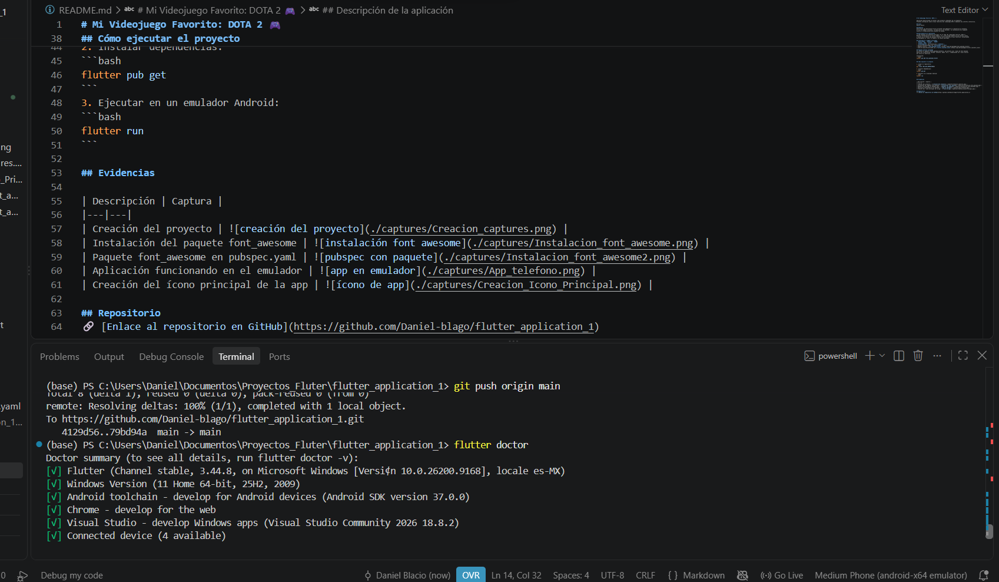 |
| Creación del proyecto en VS Code |  |
| Instalación del paquete font_awesome |  |
| Paquete font_awesome en pubspec.yaml |  |
| Creación del ícono principal de la app |  |
| Repositorio publicado en GitHub | 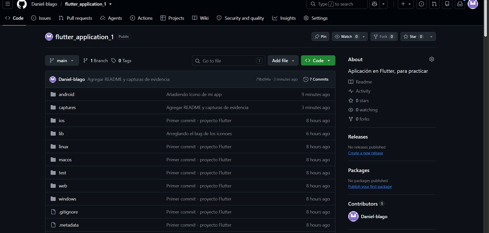 |

### Funcionamiento de la aplicación
| Descripción | Captura |
|---|---|
| Aplicación funcionando en el emulador |  |
| Funcionamiento del botón / interacción | 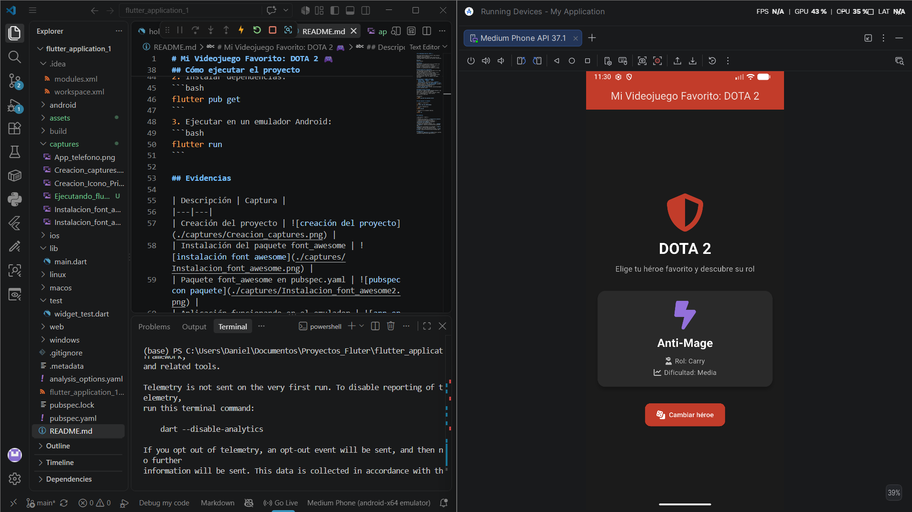 |

## Repositorio
🔗 [Enlace al repositorio en GitHub](https://github.com/Daniel-blago/flutter_application_1)


---

# Actividad Integradora 2: Navegación y Nuevos Widgets 🕹️

## Descripción breve
Se amplió la aplicación "DOTA 2 Heroes" de la Actividad Integradora 1, incorporando navegación
entre pantallas, un sistema de favoritos persistente, nuevos widgets y una mejor organización
del proyecto en carpetas.

## ¿Continuación o nueva aplicación?
Se **continuó** la aplicación desarrollada en la Actividad Integradora 1, ampliándola con
nuevas funcionalidades y pantallas.

## Nuevas funcionalidades implementadas
- Navegación entre 4 pantallas mediante `Navigator`.
- Sistema de héroes favoritos con persistencia local usando `shared_preferences`.
- Confirmación mediante `AlertDialog` antes de eliminar todos los favoritos.
- Mensajes de retroalimentación mediante `SnackBar` al marcar/desmarcar un favorito.
- Reorganización del proyecto en carpetas: `models/`, `data/`, `services/`, `screens/`.

## Pantallas desarrolladas
| Pantalla | Función |
|---|---|
| **Inicio (Home)** | Presenta el logo de la app y botones de navegación hacia la lista de héroes y los favoritos. |
| **Lista de Héroes** | Muestra todos los héroes disponibles en un `ListView`, cada uno navegable hacia su detalle. |
| **Detalle del Héroe** | Muestra información completa del héroe (rol, dificultad, descripción) y permite marcarlo/desmarcarlo como favorito. |
| **Favoritos** | Muestra en un `GridView` los héroes marcados como favoritos, con opción de vaciarlos todos. |

## Widgets nuevos utilizados
- `ListView` / `ListView.separated` (lista de héroes)
- `GridView.builder` (pantalla de favoritos)
- `ListTile` (elementos de la lista)
- `CircleAvatar` (ícono circular de cada héroe)
- `Divider` (separador entre héroes en la lista)
- `IconButton` (botón de favorito en el AppBar)
- `FloatingActionButton` (vaciar favoritos)
- `Container`, `Padding`, `SizedBox`, `Expanded` (estructura y espaciado en todas las pantallas)

## Interacciones implementadas
1. **Navegación entre pantallas**: `Navigator.push` conecta Inicio → Lista → Detalle, e Inicio → Favoritos.
2. **SnackBar**: al presionar el ícono de corazón en el detalle, se muestra un mensaje confirmando que el héroe fue agregado o eliminado de favoritos.
3. **AlertDialog**: al presionar el botón flotante en Favoritos, se pide confirmación antes de vaciar la lista.

## Funcionalidad con setState()
En la pantalla de **Detalle del Héroe**, al presionar el ícono de favorito se ejecuta `setState()`
para actualizar visualmente el ícono (de contorno a relleno) de forma inmediata, mientras el nuevo
estado se guarda de forma persistente con `shared_preferences`. Al volver a la pantalla de Favoritos,
la lista se recarga automáticamente reflejando el cambio.

## Paquete externo utilizado
**shared_preferences**: permite guardar información localmente en el dispositivo (en este caso,
la lista de IDs de héroes favoritos), de forma que los favoritos persistan incluso si el usuario
cierra completamente la aplicación.

Instalación:
```bash
flutter pub add shared_preferences
```

## Personalización realizada
- **Nombre de la app**: cambiado a "DOTA 2 Heroes" en `AndroidManifest.xml`.
- **Ícono (launcher icon)**: ícono personalizado tipo escudo generado con `flutter_launcher_icons`.
- **Logotipo**: ícono de escudo estilizado presentado en la pantalla de Inicio, dentro de un contenedor circular con borde dorado.
- **Colores personalizados**: paleta basada en el tema de DOTA 2 (rojo `#C23C2A`, dorado `#DAA520`, fondo oscuro `#1B1B1B`), aplicada consistentemente en las 4 pantallas.

## Capturas de pantalla

| Descripción | Captura |
|---|---|
| Pantalla de Inicio | 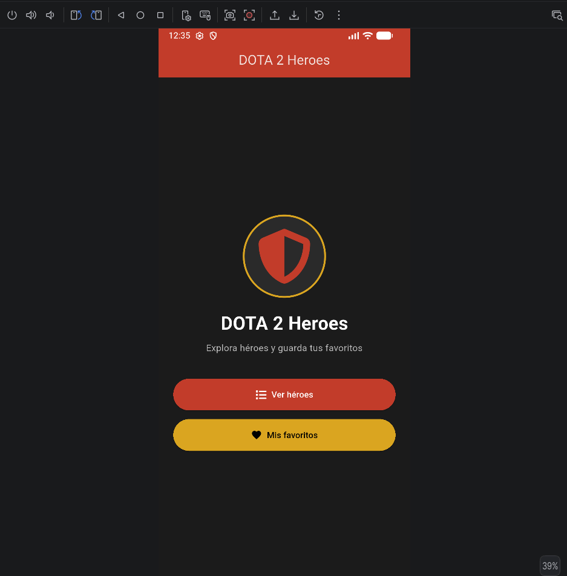 |
| Lista de Héroes | 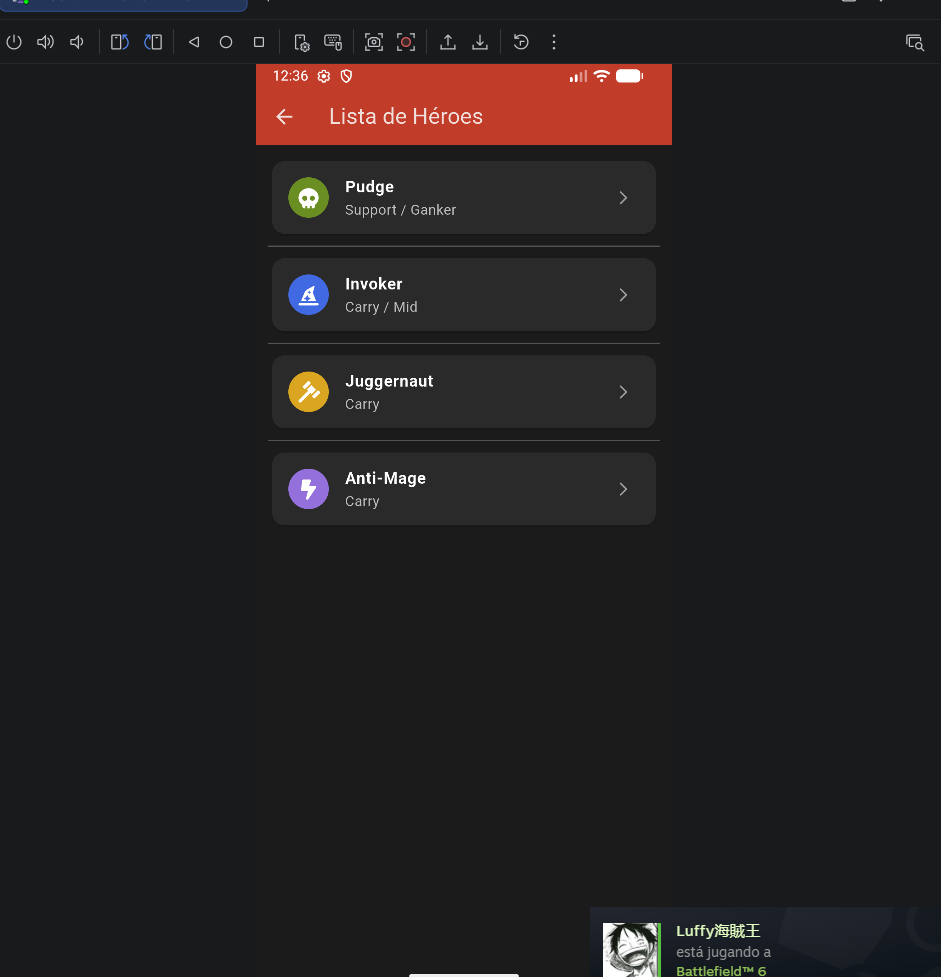 |
| Detalle del héroe | 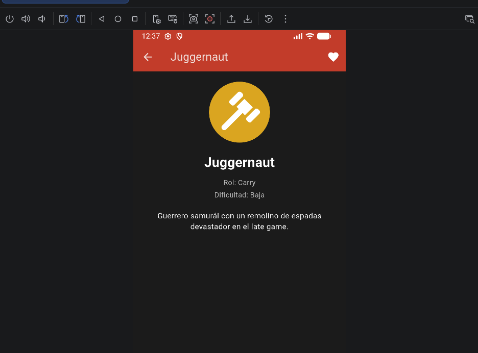 |
| SnackBar al marcar favorito | 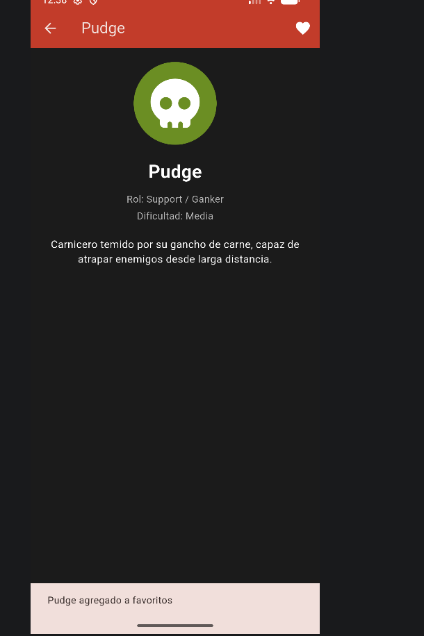 |
| Pantalla de Favoritos | 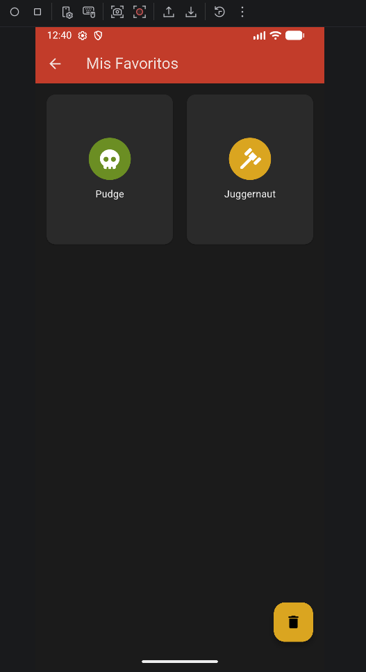 |
| AlertDialog de confirmación | 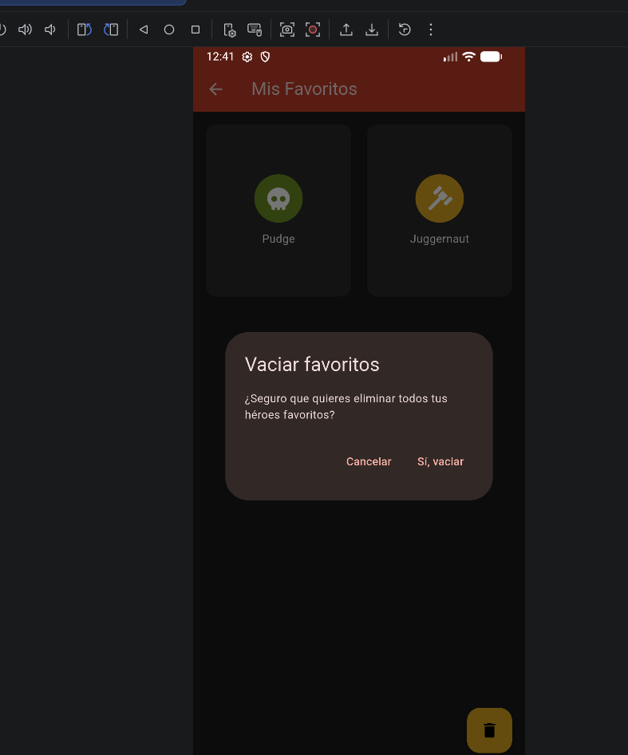 |
| Paquete shared_preferences en pubspec.yaml | 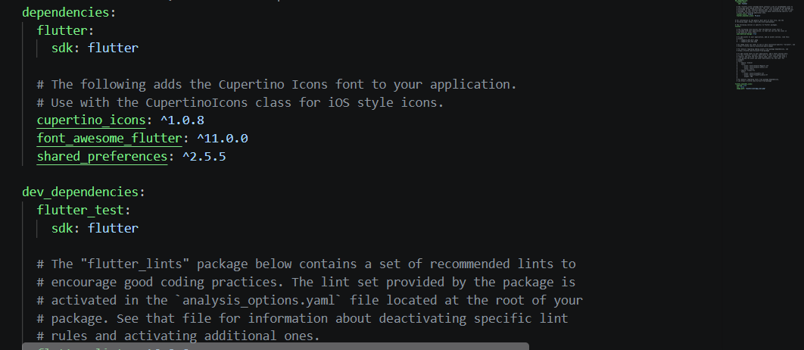 |
| Nombre de la app personalizado | 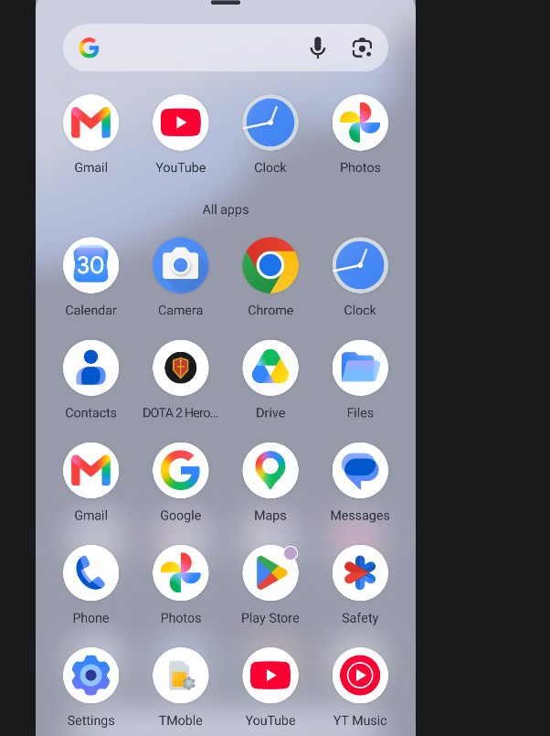 |
| Ícono de la app en el emulador | 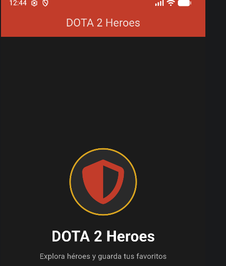 |
| Estructura de carpetas del proyecto | 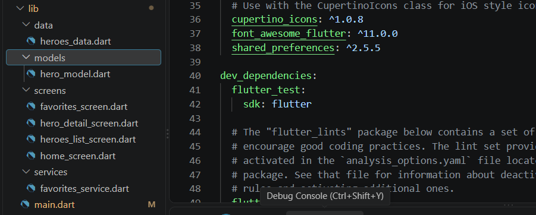 |

## Instrucciones para ejecutar el proyecto

1. Clonar el repositorio:
```bash
git clone <URL_DEL_REPOSITORIO>
```
2. Instalar dependencias:
```bash
flutter pub get
```
3. Ejecutar en un emulador Android:
```bash
flutter run
```